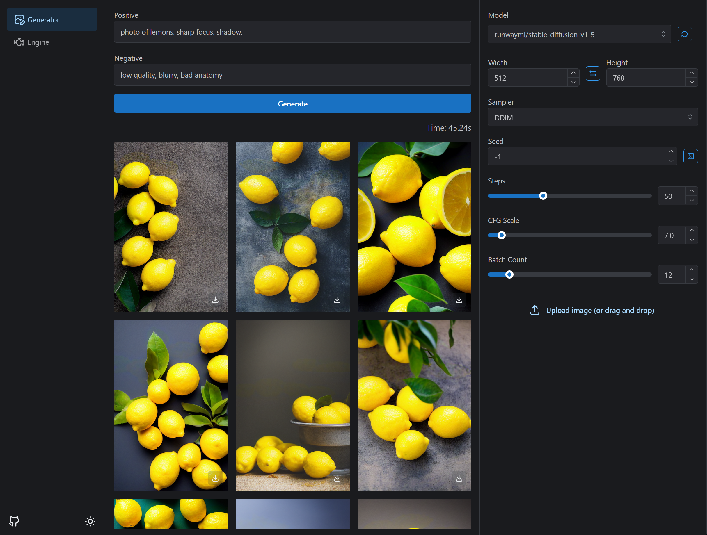
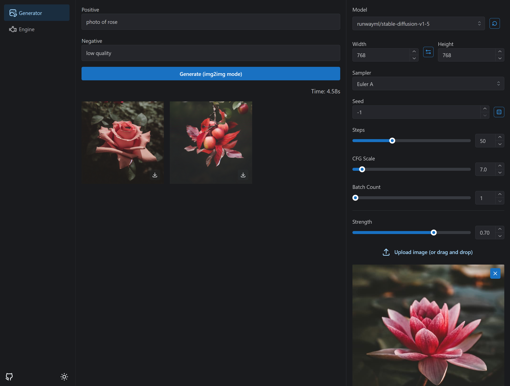

---

<b>Lsmith is a fast Stable Diffusion WebUI using high-speed inference technology with TensorRT</b>

---

# Benchmark

---

# Screenshots

- Batch generation

- img2img support

---

 

Special thanks to the technical members of the [AI 絵作り研究会](https://discord.gg/ai-art), a Japanese AI image generation community.
