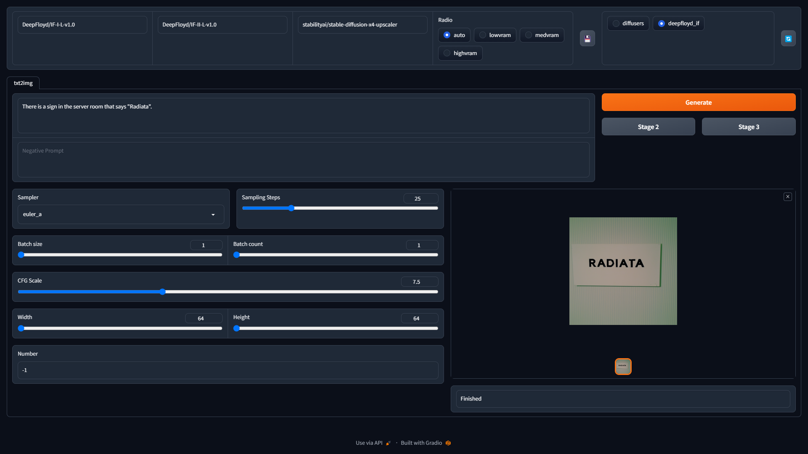
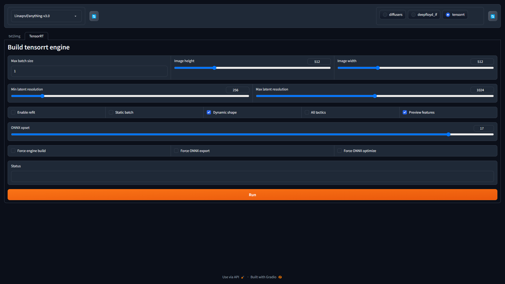

<div></div>

<div align="center">Radiata is a stable diffusion webui based on diffusers.</div>

---

# Screenshots

- Stable diffusion


- Deepfloyd IF



- TensorRT



---

<br />

# Features

- [x] Stable diffusion
- [x] DeepFloyd IF -> with `--deepfloyd_if`
- [x] Acceleration using TensorRT -> with `--tensorrt`
- [ ] ~Acceleration using AITemplate~ -> Use [`VoltaML fast stable diffusion webui`](https://github.com/VoltaML/voltaML-fast-stable-diffusion)
- [x] ControlNet -> [plugin](https://github.com/ddPn08/radiata-controlnet-plugin)
- [x] Lora & Lycoris
- [ ] Hypernetwork
- [ ] Composable lora
- [ ] Latent couple

# Installation

## Requirements

- Git
- python (3.10)
  - \*Older and newer may work but are not supported

## Windows

```
git clone https://github.com/ddPn08/Radiata.git
cd Radiata
./launch-user.bat
```

## Linux

```
git clone https://github.com/ddPn08/Radiata.git
cd Radiata
./launch.sh
```

# Documentation

https://ddpn08.github.io/Radiata/
