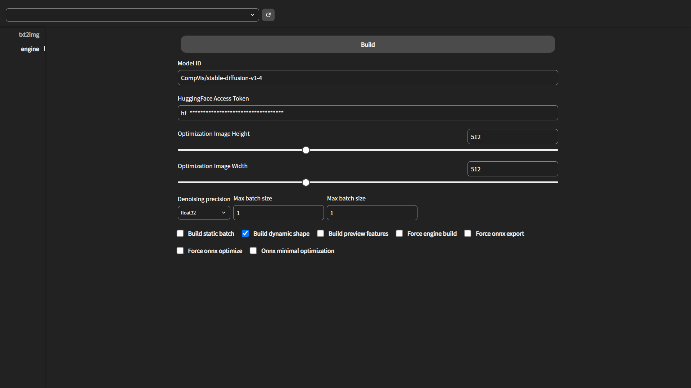
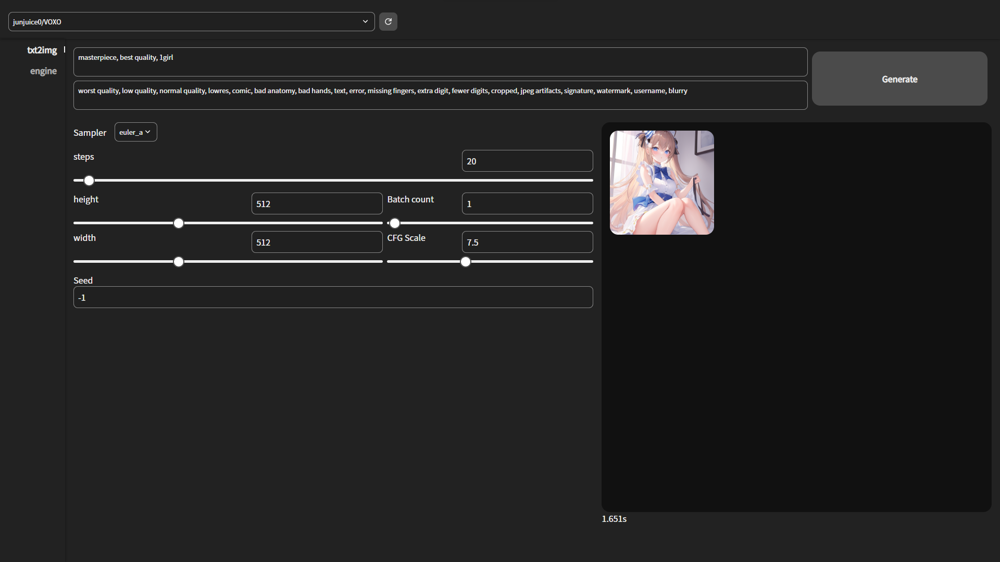

<div></div>

<div align="center">Lsmith is a fast StableDiffusionWebUI using high-speed inference technology with TensorRT</div>

---

- [Benchmark](#benchmark)
- [Installation](#installation)
  - [Docker (All platform) | Easy](#docker-all-platform--easy)
  - [Linux | Difficult](#linux--difficult)
    - [requirements](#requirements)
  - [Windows | Difficult](#windows--difficult)
    - [requirements](#requirements-1)
- [Usage](#usage)
  - [Building the TensorRT engine](#building-the-tensorrt-engine)
  - [Generate images](#generate-images)

---

# Benchmark


# Installation

## Docker (All platform) | Easy

1. Clone repository
```sh
git clone https://github.com/ddPn08/Lsmith.git
cd Lsmith
git submodule update --init --recursive
```
2. Launch using Docker compose
```sh
docker compose up --build
```

## Linux | Difficult
### requirements
- node.js (recommended version is 18)
- pnpm
- python 3.10
- pip
- CUDA
- cuDNN < 8.6.0
- TensorRT 8.5.x

1. Follow the instructions on [this](https://github.com/NVIDIA/TensorRT/tree/main/demo/Diffusion#build-tensorrt-plugins-library) page to build TensorRT OSS and get `libnvinfer_plugin.so`.
2. Clone Lsmith repository
```sh
git clone https://github.com/ddPn08/Lsmith.git
cd Lsmith
git submodule update --init --recursive
```
3. Enter the repository directory.
```sh
cd Lsmith
```
5. Enter frontend directory and build frontend
```sh
cd frontend
pnpm i
pnpm build --out-dir ../dist
```
4. Run launch.sh with the path to libnvinfer_plugin.so in the LD_PRELOAD variable.
```sh
ex.)
bash launch.sh --host 0.0.0.0
```

## Windows | Difficult
### requirements
- node.js (recommended version is 18)
- pnpm
- python 3.10
- pip
- CUDA
- cuDNN < 8.6.0
- TensorRT 8.5.x

1. Install nvidia gpu driver
2. Instal cuda 11.x (Click [here](https://docs.nvidia.com/cuda/cuda-installation-guide-microsoft-windows/) for the official guide)
2. Instal cudnn 8.6.0 (Click [here](https://docs.nvidia.com/deeplearning/cudnn/install-guide/index.html) for the official guide)
3. Install tensorrt 8.5.3.1 (Click [here](https://docs.nvidia.com/deeplearning/tensorrt/install-guide/index.html) for the official guide)
4. Clone Lsmith repository
```sh
git clone https://github.com/ddPn08/Lsmith.git
cd Lsmith
git submodule update --init --recursive
```
5. Enter frontend directory and build frontend
```sh
cd frontend
pnpm i
pnpm build --out-dir ../dist
```
6. Launch `launch-user.bat`

<br />

# Usage
Once started, access `<ip address>:<port number>` (ex `http://localhost:8000`) to open the WebUI.

First of all, we need to convert our existing diffusers model to the tensorrt engine.

## Building the TensorRT engine
1. Click on the "engine" tab

2. Enter Hugging Face's Diffusers model ID in `Model ID` (ex: `CompVis/stable-diffusion-v1-4`)
3. Enter your Hugging Face access token in `HuggingFace Access Token` (required for some repositories).
Access tokens can be obtained or created from [this page](https://huggingface.co/settings/tokens).
4. Click the `Build` button to start building the engine.
    - There may be some warnings during the engine build, but you can safely ignore them unless the build fails.
    - The build can take tens of minutes. For reference it takes an average of 15 minutes on the RTX3060 12GB.

## Generate images
1. Select the model in the header dropdown.
2. Click on the "txt2img" tab
3. Click "Generate" button.



---

<br />

Special thanks to the technical members of the [AI絵作り研究会](https://discord.gg/ai-art), a Japanese AI image generation community.
